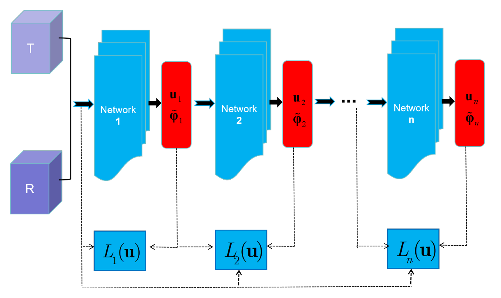

# C-I-DIRNet

This is the official Pytorch implementation of "An interpretable neural network for diffeomorphic image registration: theory and application" by Huan Han  et al. (Accepted to Inverse Problems) 

## Framework

<p align="center">
  
</p>


## Environment

The code was tested under the following environment:

| Package | Version |
| ------- | ------- |
| Python  | 3.13.5  |
| PyTorch | 2.8.0   |
| CUDA    | 12.9    |

## Project Structure

```text
C-I-DIRNet/
├── train.py          # Training script
├── test.py           # Testing script
├── generator.py      # Generate training data for the next-level network
├── model/            # Model-related files
├── data/             # Dataset folder
├── Checkpoint/       # Saved checkpoints
├── Result/           # Experimental results
└── README.md
```

## Data
The complete training data can be downloaded via the following method: The file training data.zipis shared through a cloud storage service.
Link: https://pan.baidu.com/s/12udE_E7ZnCsAIU_S5RD_MA
Access Code: enj7

